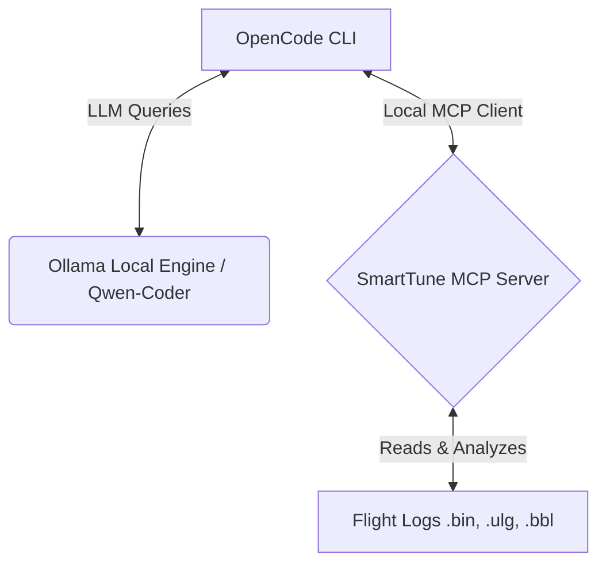

# SmartTune MCP Local Development & Setup Notes

This guide documents how to integrate the local `smarttune` Model Context Protocol (MCP) server with **Ollama**, **Qwen-Coder**, and **OpenCode** for offline flight log analysis.

---

## 1. Prerequisites & Models (Ollama)

Ensure **Ollama** is installed and running on your machine. We will use a tool-calling capable model like `qwen2.5-coder` (or `qwen3-coder` depending on your version).

To download and verify the model, run:
```bash
# Pull the recommended coder model
ollama pull qwen2.5-coder

# Verify it is loaded and running
ollama run qwen2.5-coder
```

---

## 2. Integration Architecture

The local development integration flows as follows:



### Local Pixi Task
To avoid complex environment/path mappings in your global OpenCode configuration, we configured a custom `mcp` task in [pixi.toml](file:///home/wbhinton/development/blackbox-tuning/pixi.toml):
```toml
[tasks]
mcp = { cmd = "smarttune-mcp", env = { SMARTTUNE_MCP_ALLOWED_ROOTS = "/home/wbhinton/development/blackbox-tuning:/tmp" } }
```

### Project-level OpenCode Configuration
OpenCode automatically discovers the server through the [opencode.json](file:///home/wbhinton/development/blackbox-tuning/opencode.json) file we created in the project root:
```json
{
  "$schema": "https://opencode.ai/config.json",
  "mcp": {
    "smarttune": {
      "type": "local",
      "command": ["pixi", "run", "mcp"],
      "enabled": true
    }
  }
}
```

---

## 3. How to Execute Commands

To start the interface, launch the OpenCode terminal agent from the repository root:
```bash
cd /home/wbhinton/development/blackbox-tuning
opencode
```
Once inside the OpenCode session, you can converse with your local AI coding agent. The agent will automatically have access to the `smarttune` tools.

> [!NOTE]
> All flight logs you want to analyze must reside in the directory specified in `SMARTTUNE_MCP_ALLOWED_ROOTS` (under `/home/wbhinton/development/blackbox-tuning` or `/tmp`) due to the MCP security sandbox.

### Example Prompts / User Queries:
Here are some interactive prompts you can type inside OpenCode to use the MCP server:

* **Checking Available Capabilities:**
  > *"What platforms are supported by the SmartTune tools?"*
  *(The agent will call `smarttune_list_platforms` to check capabilities).*

* **Evaluating Log Quality:**
  > *"Evaluate the data quality of the flight log at tests/data/flight_log.bin"*
  *(The agent will call `smarttune_log_quality` to inspect sample rates, logs completeness, and stick excitation).*

* **Running Comprehensive Analysis:**
  > *"Perform a full analysis on the log tests/data/flight_log.bin and output the results as markdown"*
  *(The agent will call `smarttune_analyze_log` with `response_format="markdown"`).*

* **Validating Parameters Before Recommending Changes:**
  > *"I want to suggest changing the roll axis P gain on ArduPilot to 0.15. Can you validate if ATC_RAT_RLL_P exists and if 0.15 is a valid value?"*
  *(The agent will call `smarttune_validate_param(param_name="ATC_RAT_RLL_P", param_value=0.15, platform="ardupilot")`).*

---

## 4. MCP Tools Reference

Below is a summary of the 13 tools registered on the server:

| Tool Name | Key Arguments | Description / CLI Equivalent |
|-----------|---------------|------------------------------|
| `smarttune_list_platforms` | *None* | Lists supported adapters & features. |
| `smarttune_log_quality` | `log_path`, `platform` | Evaluates completeness & data quality. |
| `smarttune_analyze_log` | `log_path`, `response_format` | Full analysis suite (PID, FFT, Filter, Mag). |
| `smarttune_analyze_pid` | `log_path`, `axis` | Wiener deconvolution step response analysis. |
| `smarttune_analyze_fft` | `log_path` | FFT vibration spectrum peak identification. |
| `smarttune_analyze_magfit` | `log_path` | Hard/soft iron compass interference check. |
| `smarttune_analyze_sysid` | `log_path`, `na`, `nb` | ARX transfer function system identification. |
| `smarttune_analyze_filter` | `log_path`, `gyro_filter_hz` | Filter transfer function Bode plot metrics. |
| `smarttune_analyze_hardware` | `log_path` | Gathers board version, active sensors, and params. |
| `smarttune_generate_plot` | `log_path`, `plot_type` | Generates base64 PNG chart (pid, fft, filter). |
| `smarttune_list_params` | `platform`, `category` | Lists all known parameters for a platform. |
| `smarttune_search_params` | `keyword`, `platform` | Searches parameter names & descriptions. |
| `smarttune_validate_param` | `param_name`, `param_value` | Safe validation against max/min/defaults. |

---

## 5. Local Development Workflow
If you make changes to files inside `smarttune-cli/smarttune/`:
1. The changes are live immediately in the pixi environment because the package is installed in **editable** mode.
2. If OpenCode is running, it runs the server as a subprocess. To load modifications to the MCP server code, simply restart your OpenCode session.
